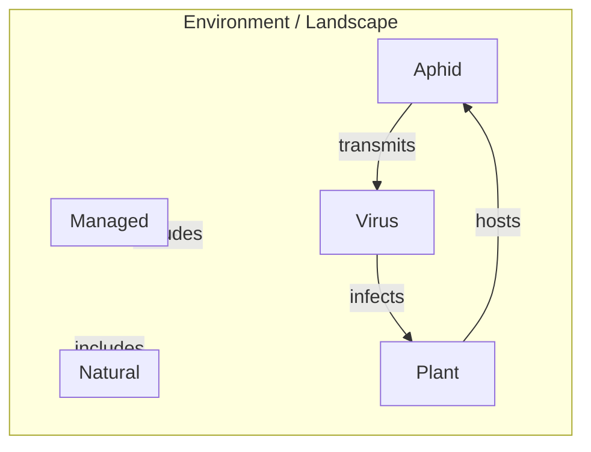

# YDV Meeting (University of Liverpool: 2024-04-08) 
## Take-Home Messages
* Pull together a funding proposal. EU doctoral training network (Marie Curie network). UK HEIs - UoL, HAU, Keele; UK RIs - JHI, RRes; EU HEIs/RIs - Teagasc, JKI, INRAE, CSIC, Ghent.
* Look into [Marie Curie Actions](https://marie-sklodowska-curie-actions.ec.europa.eu/) fellowships.
* Two phases to the proposed network: (1) UK/EU BYDV network then (2) UK/EU vector-borne disease in agricultural systems network.

 

# Day 1
## Trisna Tungadi (Keele)
* Endosymbionts are the primary focus.
* How does endosymbiont infection influence aphid odour profiles? <- is this an alternative diagnostic mechanism / how does this impact biological control?
* What are the trade-offs between virus infection and insecticide resistance? (w/ Chris Bass).
* Is Blackgrass a host for YVD? (Royal Society funded). Discuss with John Reade. No evidence that aphids use this as a host, but Rothamsted have tested this and their evidence suggests that this is possible. As Blackgrass are small plants they become overwhelmed very easily. 
* Bird cherry-oat aphid culture infected with BYDV.

## Katherine Preedy (JHI/BIOSS)
* Landscape scale arrival of aphids using GAMs. Location, year, north atlantic oscillation and cumulative temperature effects. Collated datasets. (w/ David Miller and Ken Newman). Predicting pest arrival. Cold in past = lag, cold in present = no lag.
* Field scale space and competition modelled in Julia (population model). This programme is available on request - could we collaborate on this? Computationally expensive to run - will take a while. Doesn't include probability for virus transmission. 
* Systems scale parasitoid control. Parasitoids can differentiate between uninfected and H. defensa infected aphid hosts.
* Large focus on Scottish suction sampling data.

## Lawrence Bramham (Rothamsted)
* EPG work has highlighted that aphids do not like feeding on resistant wheat (MRD049). This line is part of the wheat genetic improvement network.
* Lots of genotyping work has been carried out. qPCR is traditional but they have moved to a new genomics platform (X9) - you get up to 9216 qPCR assays per run (2 hours). Uses microfluidics to run simultaneous qPCR analyses.
* Very limited UK-specific BYDV sequencing data. This makes understanding strain variation difficult. Very low numbers of sequences available in NCBI database. Some BYDV-PAV strains are missed through classic diagnostics. Conserved SNPs have been identified - new methodologies have been developed, included Taq-Man. 
* BYDV-PAS found in R. padi and S. avenae. <- this is interesting! Is thought to outcompete other BYDV strains. This may cause issues for plant breeding companies. Is working with RAGT seeds to understand BYDV resistance. Mixed infections more likely than recognised.
* Wants to use the Rothamsted Insect Survey samples more. Feels as if this data is wasted. Routine BYDV detection is quite low 12-33% across suction traps, but this might be due to analysis potential.
* Different aphid species preferentially carry different BYDV strains. Is this seasonal or because the strains are co-infecting plants and found in different plant parts? 

## Sam Telling (ADAS)
* AHDB funded project to develop an effective (and cheap!) BYDV monitoring tool/service. Suction traps are reliable for percentage BYDV, but only for farms less than 20 km from the trap. Water traps are also good.
* Same project also looked at developing a DSS each for risk and spray. Validated in tramline trials to determine accuracy. It is accurate in untreated crops and can be used to adjust drill date. Comparable to existing AHDB T-sum tool.
* Tolerant varieties performed well in field trials.
* IPM works found low levels of BYDV across field sites despite it being predicted to be a high risk year in 2022. Looking at this again in 2023 with a broader number of partners but replacing risk adverse (4 sprays) with ACroBAT model.
* ADAS work on a lot of industry funded trials - data cannot be shown due to confidentiality.

## Louise McNamara / Stephen Byrne (Teagasc)
* Focus their research on plant, virus and aphid to capture as much as possible.
* Insecticide resistance is known in cereal aphids, like in the UK. This was the primary focus in Max's PhD. Spraying didn't increase resistance across the 50 fields studied. Resistance has not gone up post-neonicotinoids.
* Are resistant aphids super spreaders for BYDV? No... Infected aphids move differently to uninfected aphids. No impact on transmission or fecundity.
* New project called ELEVATE with UCD. This aims to link vector and virus strain with virus transmission and yield loss. Develop predictive models for yield loss. This is under current and future climate conditions.
* Fingerprinting aphid colonies prior to their use in projects.
* BYDV-MAV in all samples, BYDV-PAS and -PAV in 30% but always co-infection in the field. Resources available on GenBank.
* Developing meta-genomic methods to identify aphid pests (approx. 20). Designing new primers and testing through mock-communities. This is a part of the RapID-PEST project.

## Daniel Leybourne (Liverpool)
* Look at systems from an ecological perspective. Aphids > crops > virus > environmental change > herbivore diversity.
* A new review looking at risks to cereal crops. Link [here](https://ecoevorxiv.org/repository/view/6628/).
* Higher transmission efficiency depending on aphid species and crop variety. This is all qualitative (preliminary) data but will be followed up with quantitative data.
* Have also looked at whether all aphid vector populations equal. Naive way to look at insect pest populations is to assume that they are all the same. Endosymbiont species have an effect, but also endosymbiont strain. Clonal lineage may also have an effect - variable rates of BYDV transmission, particularly for BYDV-PAV. This appears to be the primary focus of Daniels' work at the moment. Recent work indicates that this is not true for R. padi and BYDV-MAV, but is for BYDV-PAV.
* Maintain an R. padi BYDV-PAV dataset. Unclear how many lines there are. Micro-injecting aphids with endosymbionts.
* Good resources: 18 R. padi, 31 S. avenae and 5 M. dirhodum. Also have BYDV-PAV (3) and BYDV-MAV (1) infected populations.

## Day 1 Summary
* The emergence of BYDV-PAS in the UK and its implications, alongside advancements in genotyping and sequencing for understanding strain variations, form significant discussion points.
* The role of endosymbionts, insecticide resistance, and predictive modelling for pest arrival and transmission efficiency are central to ongoing research efforts.
* Collaboration opportunities, including those involving computational modelling and genetic research, highlight a multidisciplinary approach to understanding and managing YDV.

```mermaid
graph TD
    A[Aphid Research and Management] --> B(Endosymbiont Influence)
    A --> C(Virus vs. Insecticide Resistance)
    A --> D(Landscape and Systems Scale Modeling)
    A --> E(Genetic and Genomic Advances)
    A --> F(Disease Monitoring and Management Tools)
    
    B --> G(Aphid Odour Profiles)
    B --> H(Alternative Diagnostic Mechanisms)
    B --> I(Biological Control Impacts)
    
    C --> J(Trade-offs Identification)
    C --> K(Insecticide Resistance Mechanisms)
    C --> L(Virus Infection Dynamics)
    
    D --> M(Predictive Modeling with GAMs)
    D --> N(Spatial Competition Analysis)
    D --> O(Parasitoid Efficacy in Control)
    
    E --> P(Genotyping and Phenotyping)
    E --> Q(Microfluidics for qPCR)
    E --> R(Resistance Breeding and Genetic Improvement)
    
    F --> S(BYDV Monitoring Tools)
    F --> T(IPM Strategies and Tools)
    F --> U(Insecticide Resistance Management)
    
    G --> V[Impact on Diagnostic Approaches]
    H --> W[Novel Biological Control Strategies]
    
    J --> X[Management Strategy Development]
    K --> Y[Resistance Management in Aphids]
    
    M --> Z[Climate and Environmental Factors]
    N --> AA[Julia for Computationally Intensive Analysis]
    
    P --> BB[Next-Generation Sequencing]
    Q --> CC[High-Throughput Screening]
    
    S --> DD[Utilization of Suction and Water Traps]
    T --> EE[Development of DSS for Risk and Spray Timing]
    U --> FF[Study of Resistance Spread Dynamics]
    
    style A fill:#ffccf9,stroke:#fff,stroke-width:4px
    style B fill:#ccccff,stroke:#fff,stroke-width:2px
    style C fill:#ccccff,stroke:#fff,stroke-width:2px
    style D fill:#ccccff,stroke:#fff,stroke-width:2px
    style E fill:#ccccff,stroke:#fff,stroke-width:2px
    style F fill:#ccccff,stroke:#fff,stroke-width:2px
    style G fill:#ffffcc,stroke:#fff,stroke-width:1px
    style H fill:#ffffcc,stroke:#fff,stroke-width:1px
    style I fill:#ffffcc,stroke:#fff,stroke-width:1px
    style J fill:#ffcc99,stroke:#fff,stroke-width:1px
    style K fill:#ffcc99,stroke:#fff,stroke-width:1px
    style L fill:#ffcc99,stroke:#fff,stroke-width:1px
    style M fill:#99ffcc,stroke:#fff,stroke-width:1px
    style N fill:#99ffcc,stroke:#fff,stroke-width:1px
    style O fill:#99ffcc,stroke:#fff,stroke-width:1px
    style P fill:#cc99ff,stroke:#fff,stroke-width:1px
    style Q fill:#cc99ff,stroke:#fff,stroke-width:1px
    style R fill:#cc99ff,stroke:#fff,stroke-width:1px
    style S fill:#ff9999,stroke:#fff,stroke-width:1px
    style T fill:#ff9999,stroke:#fff,stroke-width:1px
    style U fill:#ff9999,stroke:#fff,stroke-width:1px
```

 

# Day 2
## Discussion
* Do we need an insect-vectored plant virus network? Yes is the general consensus, but with an initial focus on YDV. This should be across the UK-EU in *phase 2* along with other viruses.
* PhD network might be an effective way to get training. This will involve elements of KTP, but be largely formed from UoL, Keele, HAU, Rothamsted, Teagasc and ADAS.
* Adaptation should be a key theme - future proofing. This could be abiotic (drought, flooding) or biotic (species, clonal diversity, endosymbionts, insecticide resistance).
* Miscanthus can harbour BYDV and is grown for multiple years (2-3), so may act as a reservoir. Approximately 8000 hectares are grown in the UK for biofuel, predominantly near the Severn and some in Yorkshire.
* Paper outlining standard operating procedures for characterising aphids used in bioassays (reporting genotype, endosymbionts, resistance, etc.) could be a good output.
* Paper outlining a roadmap for BYDV management could be a tangible output. Use a traffic light system - for example, using regenerative agriculture.
* Paper outlining diagnostics and sampling - what works and what doesn't - would be a good output.
* Paper outlining grand challenges/themes/priorities for virus management.
* Key challenges: viral strain diversity, vector prevalence, vector efficiency, climate change, insecticide issues (loss and resistance), plant breeding and genetics, phenotyping platform, diagnostics (ELISA and reliability), transmission, ecological impacts of natural enemies, biopesticides and biostimulants (agroecology), landscape scale, updating old science, agronomy shifts (organic, regenerative, cover cropping, etc.), modelling (first arrival), better decision support tools, robust network for monitoring aphids.

## Themes
* Key challenges: viral strain diversity, vector prevalence, vector efficiency, climate change, insecticide issues (loss and resistance), plant breeding and genetics, phenotyping platform, diagnostics (ELISA and reliability), transmission, ecological impacts of natural enemies, biopesticides and biostimulants (agroecology), landscape scale, updating old science, agronomy shifts (organic, regenerative, cover cropping, etc.), modelling (first arrival), better decision support tools, robust network for monitoring aphids.
  

(ga + gv + gp) + E

## Maya Wardeh (Liverpool)
* Animal traits can predict what makes it susceptible to a virus and vice versa. This is focused on mammals. Wants to apply existing methods to plants - is working on a [paper](https://doi.org/10.1101/2023.11.22.568327) in this area.
* Three main objectives: (1) risk assessment, (2) uncovering drivers and (3) filling knowledge gaps.
* Positive skew in much of the data as science tends to only publish positive results.
* Large focus on creating networks. I am not sure how well this aligns with our network ambitions. Very conceptual science but possibly interesting.
* Has anyone studied genetic change in BYDV over time? Very few sequences (~50) and only 1 genome.
* Interesting website detailing [descriptions of plant viruses](https://dpvweb.net/).

